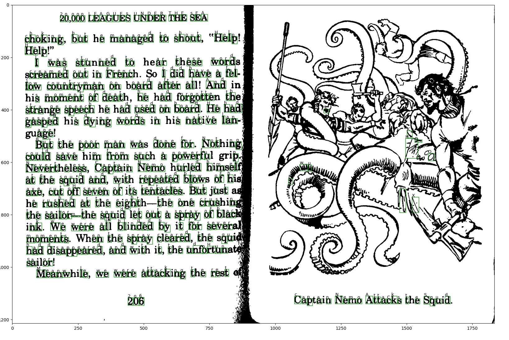

## OCR-Python

A simple approach to OCR in python using connected component labelling and a convolutional neural network.

### Dataset

* [EnglishFnt] (http://www.ee.surrey.ac.uk/CVSSP/demos/chars74k/)

**To train the model :**

```
python train.py 
```

**To validate the model :**
```
python predict.py
```



### Results

```
2ooo0 LEAGUEs UNDER HE sEA
chok ng but he managed to shout He2pt
H l
e p
I as stunned 0 hear these w0rd
scre ed 0ut n French dad k ve a el
l0w count man on board aEter all And n X
b s moment 0 death he had org0tten he GR
str nge eecb he had used on board He h d q
gasped h2s dy ng words n h s nat ve lan Y v
Page K
But the po0r man was done or Noth ng h
c0u d saVe blm Er0m such a p0werEul p M
Neverthe ess Capta n Nem0 hur ed h msel 2
at he squ2d and w th repea d b 0ws 0E h u
axe cut o seven 0E lts tentacles But ust
he rushed at the e ghth the one crush n YN N
the sa l0r the squ d et 0 a spr y 0f blac
nk we were a1 b Inded by at G0r sever Y
m0ments en the spr y cleared the squ
had dls ppeared and w h 2t the uso un
sal or
Meanwhlle we were a tack ng the reSt v
2o6 Capta n Nemo Attacks tbe squ d
```


